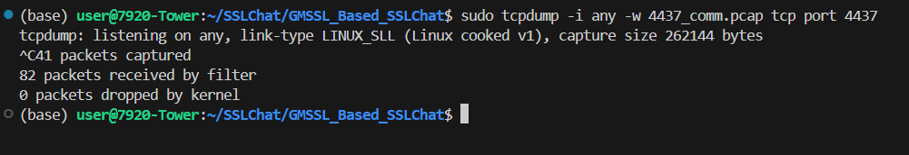
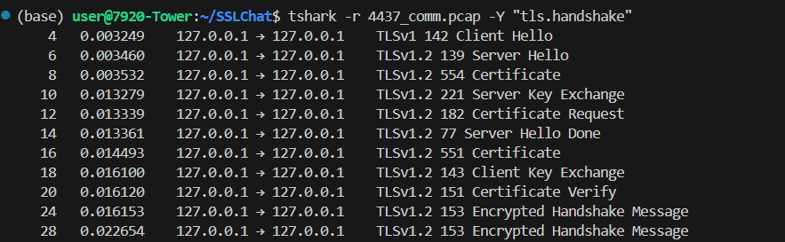
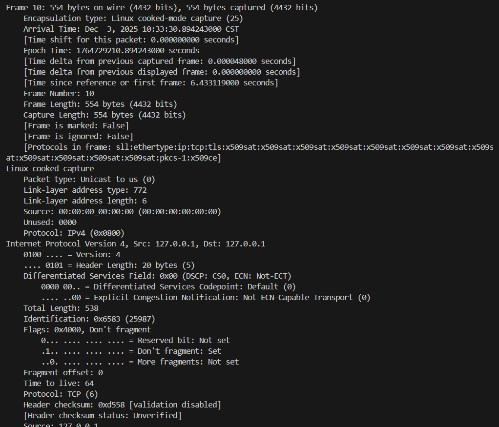

# GMSSL Based SSLChat

这是一个基于 GmSSL 库实现的简易 SSL/TLS 聊天程序。它包含一个服务端 (`tls_server`) 和一个客户端 (`tls_client`)，支持通过加密通道进行即时通讯。

## 功能特点

- **安全通信**: 使用 GmSSL 提供的 TLS 协议（支持国密算法 SM2/SM3/SM4）进行加密通信。
- **双向认证**: 支持客户端和服务端双向证书认证。
- **多线程处理**: 使用多线程分别处理消息的发送和接收，实现全双工聊天。
- **聊天记录**: 客户端会自动将聊天记录保存到本地文件。

## 依赖项
- **Ubuntu**: 推荐运行环境。
- **Wireshark/TShark**: 用于抓包分析 (可选)。
  ```bash
  sudo apt update && sudo apt install -y tcpdump tshark
  ```
- **GmSSL**: 需要安装 GmSSL 库，参考 [GmSSL GitHub](https://github.com/guanzhi/GmSSL) 和 [GmSSL 官网](http://gmssl.org/)。
- **pthread**: POSIX 线程库 (通常系统自带)。
- **GCC**: C 语言编译器。

## 目录结构

- `tls_server.c`: 服务端源代码。
- `tls_client.c`: 客户端源代码。
- `Makefile`: 项目构建文件。
- `certs/`: 存放证书和密钥文件 (CA证书, 服务端/客户端 证书及私钥)。
- `config.h`:配置文件，包含 IP、端口、证书路径等定义。

## 编译

在项目根目录下执行 `make` 命令即可编译服务端和客户端：

```bash
make
```

编译成功后会生成 `tls_server` 和 `tls_client` 可执行文件。

## 配置 (config.h)

确保目录下存在 `config.h` 文件，并包含以下配置（示例）：

```c
#define SERVER_IP "127.0.0.1"
#define SERVER_PORT 4437
#define CA_CERT_FILE "certs/ca-cert.pem"
#define SERVER_CERT_FILE "certs/server-cert.pem"
#define SERVER_KEY_FILE "certs/server-key.pem"
#define CLIENT_CERT_FILE "certs/client-cert.pem"
#define CLIENT_KEY_FILE "certs/client-key.pem"
#define CHAT_HISTORY_FILE "chat_history.txt"
#define PASSWORD "123456"
```

## 运行

### 1. 启动服务端

```bash
./tls_server
```

服务端启动后会监听配置的端口，等待客户端连接。

### 2. 启动客户端

```bash
./tls_client
```

客户端启动后，根据提示操作：
- 输入 `1`：连接服务端，开始加密聊天。
- 输入 `2`：验证密码后查看本地历史聊天记录。

### 3. 退出

在聊天窗口输入 `exit` 并回车即可断开连接并退出程序。

## 证书生成

本项目依赖国密证书，请使用 GmSSL 工具生成所需的 CA 证书以及服务端、客户端的证书和私钥，并放置在 `certs/` 目录下。


## 抓包与分析

本项目使用国密 SSL 协议，可以使用 `tcpdump` 和 `tshark` 进行抓包和分析。

### 1. 抓取数据包
使用 `tcpdump` 监听端口并保存报文：
```bash
sudo tcpdump -i any -w 4437_comm.pcap tcp port 4437
```


### 2. 分析握手过程
查看 TLS 握手交互流程：
```bash
tshark -r 4437_comm.pcap -Y "tls.handshake"
```


### 3. 查看证书详情
查看握手过程中的证书信息（Certificate 消息）：
```bash
# 查看详细解码信息
tshark -r 4437_comm.pcap -Y "tls.handshake.type == 11" -V

# 或者提取关键字段（如证书主题、颁发者、有效期）
tshark -r 4437_comm.pcap -Y "tls.handshake.type == 11" -V | grep -E "Handshake Type|subject|issuer|notBefore|notAfter"
```

## License

See [LICENSE](LICENSE) file.
